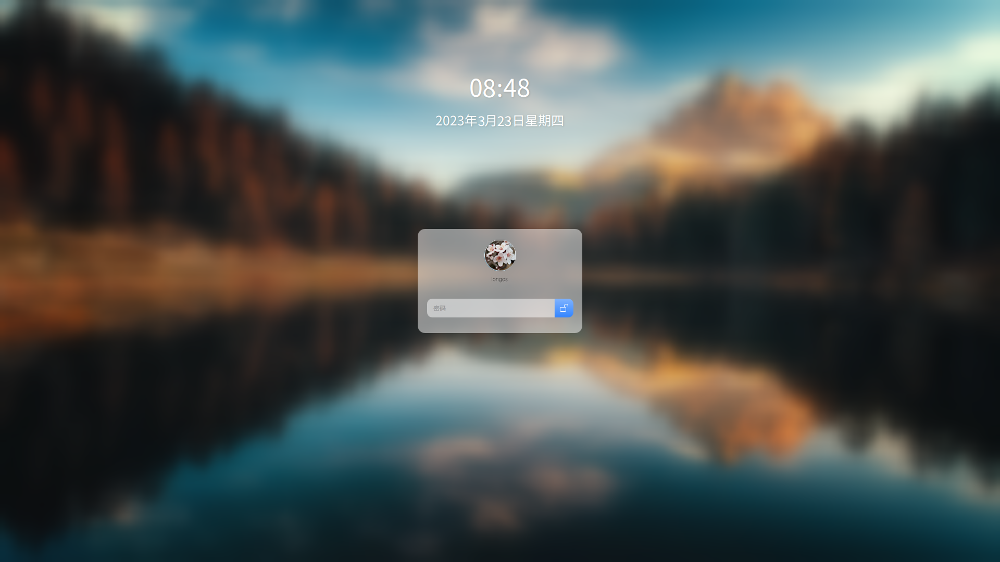

# LongOS的SDDM主题环境



## 依赖包

For Debian/Ubuntu:
```shell
apt install build-essential cmake extra-cmake-modules qtbase5-dev qtdeclarative5-dev qtquickcontrols2-5-dev qttools5-dev qttools5-dev-tools
```

构建:
```shell
mkdir build
cd build
cmake ..
make
```
